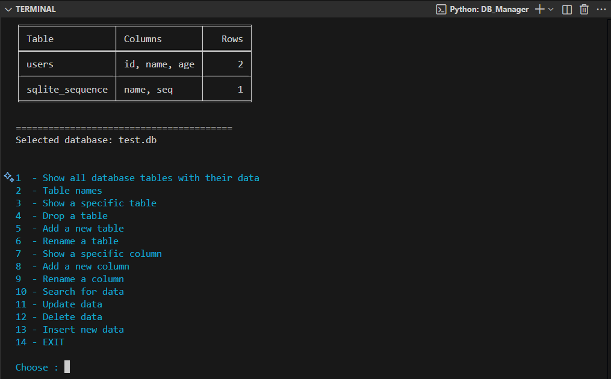

# 🗃️ SQLite DB Manager

# DB Manager Pro

A modern, interactive command-line tool for managing SQLite databases.  
This tool allows you to create, edit, and explore `.db` files easily using Python.



---

## Features
- Create, rename, and delete databases or tables  
- Add, rename, and remove columns  
- Insert, search, update, and delete data  
- Colorful and user-friendly terminal menus  
- Automatically detects all `.db` files in the current directory  
- Pretty table printing using the `tabulate` library (with fallback if not installed)

---

## Installation

1. Clone the repository:
   ```bash
   python DB_Manager.py
   

##✨ Author
  Developed by Ali Emad
